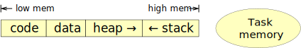
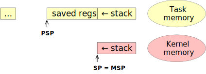
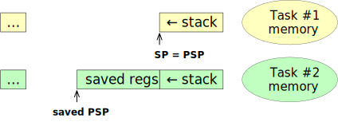

**(TBD)**

---
# Message passing protocol

The kernel is based on three primitives: **IPC Send**, **IPC Call**, and **IPC
Recv**.

## IPC Send

Send a message to a specified task, and continue without waiting. The request
will fail immediately if the destination is not currently ready to receive
messages:

## IPC Call

Send a message to a specified task and wait until there is a reply message:

## System Call

System calls are transformed into IPC Calls to the System Task (Task #0). They
only transfer argument lists and reply codes, not complete messages:

## IPC Recv + Send

When a task does an IPC Recv, it blocks until a message arrives via IPC Send:

## IPC Send + Recv

If the IPC Send is done before the destination is receiving, the send will fail
and the destination will then wait for a next message. Sends are _asynchronous_:

## IPC Recv + Call

With an IPC Call, the exchange consists of a request and a reply message, and
everything will block to make this "rendezvous" happen in the right order:

## IPC Call + Recv

When calls are made before the destination is ready to receive, they will be
queued at the receiving end and picked up as soon as IPC Recv requests are made.
Calls are _synchronous_:

# Memory use and tasks

### Applications in memory

A traditional RAM-based application has the following memory layout:

This is the same as in Unix/POSIX systems, with "data" split in initialized and
uninitialized (but zeroed-out) areas.  The "code" area may also be located in
flash.  Each of these areas may contain pointers into any of the areas, and
since ARM Cortex-M processors do not support _virtual memory_, these areas
cannot be moved once allocated. This severely limits what can be loaded
dynamically.

What's of most interest here, is the _call stack_, which grows down, towards
lower memory addresses. The stack area contains nested function calls and their
local variables, in the form of _stack frames_.

### Interrupts and system calls

With a multi-tasking kernel, everything becomes a bit more complicated. There
will now be multiple _tasks_ in memory, each with their own data, heap, and
stack in RAM. Each task defines a "context", i.e. the complete state of that
task, not only in RAM, but also including its program counter and other active
CPU registers.

Switching tasks can happen either through a hardware interrupt, or through a
"system call" to the kernel (using the "SVC" instruction). Hardware interrupts
can happen anytime, and are _asynchronous_. Whereas system calls are like
function calls, in that they are triggered at specific points in the code, and
are therefore _synchronous_ with the program flow. The reason it's called a
_system_ call, is that it also marks the entry into the kernel, which has more
privileges.

Interrupts and system calls are processed in an almost identical fashion:

1. the current state of the CPU is pushed onto the hardware stack
2. control is transferred to the corresponding "handler" code
3. the handler does what it needs to do
4. the state of the CPU is restored to its saved state
5. execution resumes from where it had been interrupted

There are many types of interrupts and system calls, each with their own
processing requirements. They may be rather complex and require quite a few
nested function calls, as well as temporary local stack space. To avoid having
to reserve space for this in _each_ task, the ARM Cortex-M hardware uses a very
effective trick: right after the context has been pushed onto the task's own
_process_ stack (PSP), it switches over to a separate _master_ stack (MSP).

Thus, a single well-dimensioned stack can provide space for all the handler
processing, regardless of when and where it is needed. This even includes
_nesting_ of interrupts, which greatly helps to quickly process the really
urgent interrupts.

This is the memory use for a task running without any interrupts or system
calls, with the code / data / heap areas shortened to "..." for clarity:

When an interrupt or system call gets control, it changes to this:

Note that the stack pointer now points to a different stack in memory. As the
handler code runs, it can push and pop stack frames at will, without interfering
with any _task_ areas.

If another higher-priority interrupt needs to be handled, we end up with:

Most importantly, there is no risk of exceeding the space allocated for any
task's stack, since it's not the active stack anymore.  Eventually, the
interrupt and/or system call handlers all return, the saved registers are
restored, and processing resumes where it left off:

The master stack is empty again, and the task stack is back to normal.

### Context switches

So far, this has been a description of a single task being interrupted and then
resuming.  Things change with multiple tasks as a little _bait-and-switch_ trick
is performed, whereby the resumed task is _not_ the one that got interrupted.

This is surprisingly easy to do: all that's needed is to change the PSP, i.e.
the _Process Stack Pointer_, before returning from the interrupt or system call. 

Here are two tasks, task #1 is currently active, and task #2 has been scheduled
to run next:

After the "context switch", the situation is effectively reversed, with task #2
now active:

Note that the other task's "saved PSP" can no longer be held in the PSP
register, it has to be saved somewhere in RAM. The kernel maintains a little
area for each task, to store the PSP and a few other task-specific details.

With ARM Cortex-M, context switching is done through a special "PendSV"
interrupt handler, which pushes some register state, switches the PSP around,
and pops the register state of the now-active task to resume it. There is a very
brief moment while things are switched around that an unrelated hardware
interrupt _could_ occur, but due to the details of how PendSV works, this does
not cause any problems.

### Tricky details

The model presented so far is accurate, but glosses over a few tricky details.
For one, note that interrupts can happen at any point in time, even during the
entry or exit of another interrupt or system call. As a result, interrupt code
can make almost no assumptions about the "current context".

Interrupt priorities matter a great deal, as more urgent interrupts can nest
"into" currently running interrupt handlers, or even the processing of a system
call.

All is not lost however: system calls can only take place where they're called
in the code, and since system calls have been given a very low priority, they
cannot be used anywhere other than in tasks. A system call inside an interrupt
handler or inside another system call will generate a "hard fault" and lead to
abrupt system termination (with a "panic message" to explain what happened).

This means that the saved registers on a task stack are either the result of a
system call (now in progress), or a – presumably brief – interruption of the
current task, to be resumed soon. System calls can never appear on the master
stack.

Another observation is that data on the master stack is never juggled around or
used in tricky ways: all it does is offer some space for the nesting of handlers
and function calls, and this nesting always cleans up in a pure
last-in-first-out fashion. The only stack switching that can happen is when a
different task's saved PSP is resumed, right after the master stack becomes
empty again.

System calls always run to completion. That does not mean that a task always
gets control back immediately, though. One of the things a system call (or any
of the interrupt handlers) can do, is schedule a context switch and trigger a
PendSV request. Due to the way nesting and priorities work together, the context
switch will happen at a very precisely defined moment: _just_ before returning
control to a task, when no interrupts are pending. This also means that context
switches always happen when nothing else is going on.
